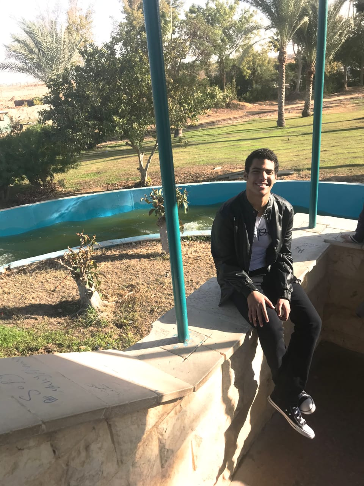

# Welcome To My Personal Website
## Mohammed Almotasem

####  A Biomedical Engineering student at Cairo University. 
#### graduation year: 2021
#### Born in 1998
### e-mail: mohammed.almotasem55@googlemail.com
### [My CV](https://drive.google.com/file/d/1Gc6SpsvlYG9Fpmco_Da8JnqnQtPYCiIo/view?usp=sharing)
#### looking forward to work in Bioinformatics field
#### Interested in machine leaning and programming

## Projects and Education:

Took Training courses in Medical Equipment and Embeedded systems
Working on a machine learning project using the biostatistics fundementals that aims to predict the conditions of a patient that had a heart attack whether he will survive for a year or not. [check details](https://marwaomar.github.io/Marwa-Abdalla//chronic-kidney-disease/)

## Skills :
- Technical Skills:

	- Programmin languages: c++, c, python, R
    - Web developing
    - Problem solving
    - Embedded systems crafting

- Soft Skills:

    - Presentation Skills
    - Negotiatian Skills
    - Team working
    - Leadershipping
    - Time managing

### Hobbies:
Listenning music, watching movies and Computer gaming

# To get in touch:

          
